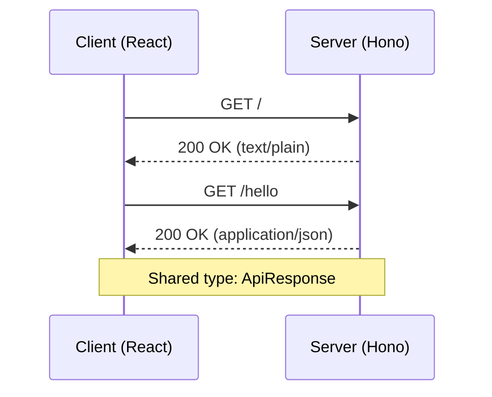

# Public Interface & Contracts

## Interface Map



## Endpoints / Exports

The API is defined within [[server/src/index.ts]] using the Hono framework.

| Method | Path | Status | Description |
| :--- | :--- | :--- | :--- |
| GET | `/` | 200 | Returns "Hello Hono!" |
| GET | `/hello` | 200 | Returns `ApiResponse` payload |

> [!IMPORTANT]
> The `client` utilizes `hono/client` via [[server/src/client.ts]] to maintain end-to-end type safety, deriving its contract directly from the `app` export in [[server/src/index.ts]].

## Data Models

Data structures are defined in [[shared/src/types/index.ts]] and consumed by both the client and server.

### `ApiResponse`

Used for the `/hello` endpoint response.

```json
{
  "message": "string",
  "success": true
}
```

Example Response:
```json
{
  "message": "Hello BHVR!",
  "success": true
}
```

## Contract Risks

*   **Unresolved Imports**: The dependency analysis indicates unresolved import specifiers in [[client/src/routeTree.gen.ts]] (`./routes/__root`) and [[shared/src/index.ts]] (`./types`). While the build pipeline manages this via workspace resolution, it poses a risk to static analysis tooling integrity.
*   **Environment Dependency**: The client relies on `import.meta.env.VITE_SERVER_URL` for API discovery. If this environment variable is missing, it defaults to `http://localhost:3000`, which may cause runtime failures in production environments if not correctly injected at build time.
*   **Type Safety Coupling**: The client contract is strictly coupled to the `server/src/index.ts` export. Any breaking change in the Hono app structure will propagate to the client build immediately.

# OpenAPI Specification