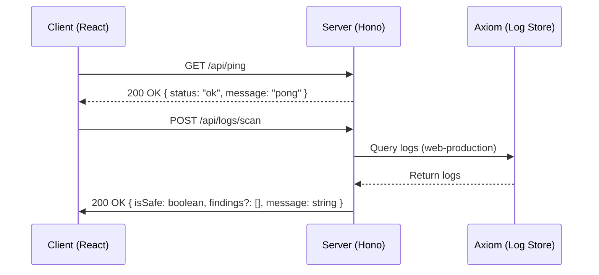

# Public Interface & Contracts

## Interface Map



## Endpoints / Exports

The API is served under the `/api` prefix via [[server/src/index.ts]].

| Method | Path | Description | Status Codes |
| :--- | :--- | :--- | :--- |
| `GET` | `/api/ping` | Health check endpoint | 200 |
| `POST` | `/api/logs/scan` | Scans production logs for sensitive data | 200, 413 |

> [!IMPORTANT]
> The `/api/upload/*` path is protected by a 4MB `bodyLimit` middleware. Exceeding this limit returns `413 Payload Too Large`.

## Data Models

Shared types are defined in [[shared/src/types/index.ts]].

### `ScanResult`
Returned by `POST /api/logs/scan`.

```json
{
  "isSafe": false,
  "message": "Find issues please remove sensitive data!",
  "findings": [
    {
      "ruleId": "credit-card",
      "ruleName": "Credit Card Leak",
      "severity": "critical",
      "matchedText": "Card detected and masked"
    }
  ]
}
```

### `LeakFinding`
Nested within `ScanResult`.

| Field | Type | Description |
| :--- | :--- | :--- |
| `ruleId` | `string` | Identifier for the detection rule |
| `ruleName` | `string` | Human-readable name of the rule |
| `severity` | `string` | Severity level (e.g., "critical") |
| `matchedText` | `string` | The context or masked text found |

## Contract Risks

> [!CAUTION]
> The `POST /api/logs/scan` endpoint currently performs a hardcoded regex scan on logs fetched from Axiom. There is no request body validation in the code provided; the `ScanRequest` type exists in [[shared/src/types/index.ts]] but is not utilized in the `POST` handler, creating a drift between the defined schema and the implementation.

> [!WARNING]
> The `cors` configuration in [[server/src/index.ts]] is explicitly locked to `http://localhost:5173`. This will break in production environments unless the `ALLOWED_ORIGIN` is dynamically injected.

# OpenAPI Specification