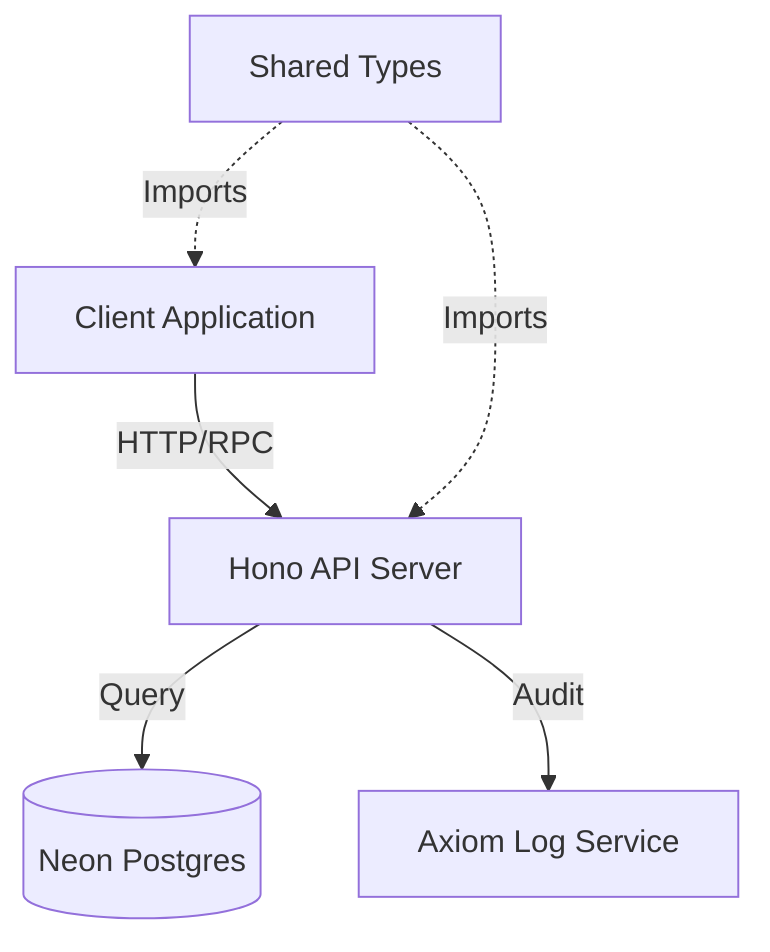
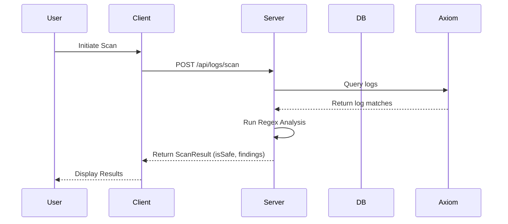

# Deep Engineering Architecture

## Global Data Flow
The system operates as a monorepo utilizing a client-server architecture where the frontend consumes end-to-end type-safe RPC-like endpoints generated by the backend. Shared domain types reside in a dedicated package to ensure contract consistency.

*Traceability: [[client/src]], [[server/src]], [[shared/src]]*

## Core Interface Flows
The following sequence illustrates the primary scan request path.

*Traceability: [[client/src/routes/index.tsx]], [[server/src/index.ts]]*

## Architectural Decision Records (ADRs)

### ADR-001: Monorepo Structure with Shared Types
- **Context**: The project requires strict consistency between client-side data consumption and server-side data models.
- **Decision**: Implement a monorepo using `turbo` with a dedicated `[[shared/src/index.ts]]` workspace.
- **Rationale**: Centralizing shared types prevents synchronization drift and enables seamless type-safe RPC via `hono/client`.
- **Consequences**: Simplified cross-package dependencies, but requires adherence to workspace build order.

### ADR-002: Hono for API Layer
- **Context**: Need for a lightweight, fast, and type-safe API framework compatible with runtime environments like Bun.
- **Decision**: Use `[[server/src/index.ts]]` powered by Hono.
- **Rationale**: Hono provides first-class support for `hcWithType` (end-to-end type safety) and middleware-based request processing.
- **Consequences**: Excellent performance and developer experience, but requires strict adherence to Hono's middleware patterns.

## Module Deep-Dives

### Module: [[server/src/index.ts]]
- **Responsibility**: API entrypoint, routing, and request security middleware.
- **Internal Logic**: Configures Hono with security headers, CORS, body limits, and defines the `/logs/scan` endpoint.
- **Upstream Callers**: Client-side `[[client/src/routes/index.tsx]]`.
- **Downstream Dependencies**: `[[server/src/axiom.ts]]`, `[[shared/src/types/index.ts]]`.

### Module: [[server/src/db/index.ts]]
- **Responsibility**: Database connectivity and ORM initialization.
- **Internal Logic**: Uses `neon-http` driver with `drizzle-orm` to bridge the application to Postgres.
- **Upstream Callers**: `[[server/src/modules/scan/scan.service.ts]]` (implied), `[[server/src/index.ts]]`.
- **Downstream Dependencies**: `[[server/src/db/schema.ts]]`, `[[server/src/env.ts]]`.

### Module: [[client/src/routes/index.tsx]]
- **Responsibility**: UI entrypoint and main application dashboard.
- **Internal Logic**: Utilizes TanStack Query for state management and `hcWithType` for type-safe server communication.
- **Upstream Callers**: `[[client/src/main.tsx]]`.
- **Downstream Dependencies**: `[[server/src/client.ts]]`, `[[client/src/shared/ui/badge.tsx]]`.

## Structural & Integration Risks

> [!WARNING]
> The architectural graph contains **Hotspots** (e.g., `[[server/src/env.ts]]`, `[[server/src/client.ts]]`) that are central to the system. Excessive reliance on these modules for configuration and connectivity creates a high blast radius for changes.

> [!CAUTION]
> Numerous **Orphan Modules** (e.g., `[[client/src/entities/incident/index.tsx]]`, `[[client/src/widgets/sidebar/index.tsx]]`) were detected. These likely represent unlinked or dead code paths that complicate the architectural mental model.

> [!NOTE]
> Dependency graph reliability is partial due to unresolved internal imports in `[[client/src/routeTree.gen.ts]]` and `[[shared/src/index.ts]]`. Automated tooling should be configured to resolve these to improve audit precision.