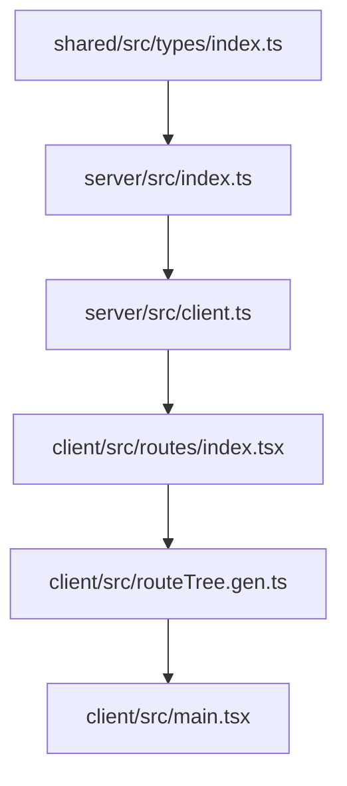
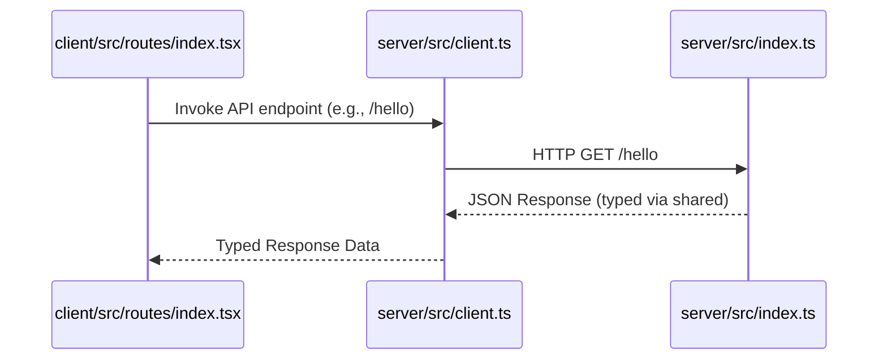

# Deep Engineering Architecture

## Global Data Flow
The architecture follows a monorepo structure utilizing Bun workspaces to manage dependencies between the client, server, and shared packages. Data flows from the [[server/src/index.ts]] Hono API, which shares type definitions via [[shared/src/types/index.ts]] to provide type-safe RPC-like consumption on the client side through [[server/src/client.ts]].

*Traceability Legend:*
- [[shared/src/types/index.ts]] (Shared)
- [[server/src/index.ts]] (Server)
- [[server/src/client.ts]] (Client Bridge)
- [[client/src/routes/index.tsx]] (Client UI)
- [[client/src/routeTree.gen.ts]] (Route Tree)
- [[client/src/main.tsx]] (Entrypoint)

## Core Interface Flows
This sequence diagram illustrates the lifecycle of a client request to the server API, highlighting the usage of shared types for end-to-end type safety.

*Traceability Legend:*
- [[client/src/routes/index.tsx]] (UI)
- [[server/src/client.ts]] (Bridge)
- [[server/src/index.ts]] (API)

## Architectural Decision Records (ADRs)

### 🚀 ADR-001: Monorepo Workspace Strategy
- **Context**: The project requires strict separation between client-side UI, server-side logic, and shared domain models while maintaining developer experience.
- **Decision**: Utilize Bun workspaces defined in [[package.json]] to link `server`, `client`, and `shared` packages locally.
- **Rationale**: Enables internal package linking without publishing to a registry, simplifies cross-package refactoring, and enforces clear boundary lines between domains.
- **Consequences**: Requires `turbo` for orchestration of builds and dependency management, but ensures consistent type definitions across the stack.

### 🛡️ ADR-002: End-to-End Type Safety via Hono Client
- **Context**: To avoid manual API contract maintenance, the frontend needs to be aware of backend route definitions.
- **Decision**: Export Hono app types from [[server/src/index.ts]] and consume them in [[client/src/routes/index.tsx]] using the `hcWithType` utility from [[server/src/client.ts]].
- **Rationale**: Provides compile-time safety for API requests. Any change to the server response structure in [[server/src/index.ts]] will immediately surface as a type error in the client.
- **Consequences**: Tight coupling between `server` and `client` packages, which is an intentional trade-off for productivity and runtime reliability.

## Module Deep-Dives

### Module: [[server/src/index.ts]]
- **Responsibility**: Acts as the primary backend entrypoint. Defines HTTP routes and provides the `AppType` for client-side type inference.
- **Internal Logic**: Implements a Hono application instance with CORS middleware and route handlers.
- **Upstream Callers**: [[client/src/routes/index.tsx]] (via client bridge), [[server/src/client.ts]].
- **Downstream Dependencies**: [[shared/src/types/index.ts]].

### Module: [[client/src/routes/index.tsx]]
- **Responsibility**: Provides the main UI view and handles data fetching from the server.
- **Internal Logic**: Uses TanStack Query for state management and the Hono client bridge to interact with the backend.
- **Upstream Callers**: [[client/src/routeTree.gen.ts]].
- **Downstream Dependencies**: [[server/src/client.ts]], [[client/src/assets/beaver.svg]].

### Module: [[server/src/client.ts]]
- **Responsibility**: Provides a bridge for the client to consume backend types.
- **Internal Logic**: Exports a typed Hono client wrapper (`hcWithType`) that references the backend `AppType`.
- **Upstream Callers**: [[client/src/routes/index.tsx]].
- **Downstream Dependencies**: [[server/src/index.ts]].

## Structural & Integration Risks

> [!WARNING]
> **Orphan Module Risk**: Several modules, including [[client/src/routes/__root.tsx]], [[client/src/main.tsx]], and [[shared/src/index.ts]], are identified as orphans or lack inbound references in the static analysis. While these are necessary for the build process (e.g., entrypoints or route providers), their lack of explicit dependency flow makes it difficult to trace their integration path without deep knowledge of the build tooling.

> [!CAUTION]
> **Contract Risks**: The dependency graph indicates unresolved imports (e.g., `./routes/__root` in [[client/src/routeTree.gen.ts]]). This suggests the static analysis tool cannot fully resolve the TanStack Router auto-generated code, which poses a risk for architectural audits.

> [!NOTE]
> **Hotspot Risk**: [[server/src/index.ts]] and [[server/src/client.ts]] are identified as high-risk hotspots. As these files contain the API contract and the client bridge, any modification here carries a higher risk of breaking the entire application's data flow. Frequent refactoring is discouraged unless accompanied by comprehensive integration tests.